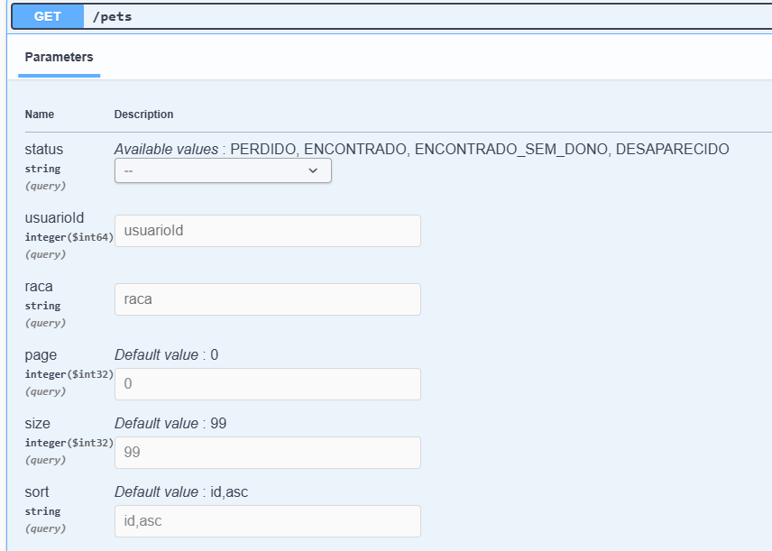

# 🐾 EncontreSeuPet API

API desenvolvida em **Spring Boot** como parte da **pós-graduação em Arquitetura de Software do Instituto Infnet**.  
O sistema tem como objetivo auxiliar na **busca, registro e acompanhamento de pets desaparecidos**, conectando pessoas que perderam seus animais com quem os encontrou.


<p align="center">
  
</p>
<p align="center">
  💚 <strong>Dedicado a <em>Fernandes</em>, o gato que inspirou este projeto.</strong>
</p>


---

## ⚙️ Funcionalidades

- 🐕 **Cadastro de Pets:** registre informações detalhadas sobre o animal (nome, espécie, cor, descrição e status).
- 👤 **Gestão de Usuários:** cada usuário pode cadastrar e gerenciar seus próprios pets.
- 👀 **Avistamentos:** registre quando e onde um pet foi visto.
- 📍 **Localização:** cada avistamento possui latitude, longitude e endereço associados.
- 🔔 **Notificações:** usuários podem receber alertas sobre novos avistamentos.
- 📊 **Consulta e Filtros:** visualize pets desaparecidos, encontrados ou adotados.


---
## 📘 Documentação

A API possui documentação interativa via **Swagger UI**, onde é possível visualizar todos os endpoints, parâmetros e exemplos de requisição e resposta.  
Acesse em: [http://localhost:8080/swagger-ui/index.html](http://localhost:8080/swagger-ui/index.html)


### 🧩 Diagrama 


---


## 📍 Endpoints Disponíveis

### 🧍‍♂️ Usuários

| Método | Rota | Descrição |
|:------:|------|------------|
| `POST` | `/usuarios` | Cria um novo usuário |
| `GET` | `/usuarios` | Lista usuários com filtros (nome, email, telefone) |
| `GET` | `/usuarios/{id}` | Busca usuário pelo ID |
| `DELETE` | `/usuarios/{id}` | Remove um usuário |


---

### 🐕 Pets

| Método | Rota | Descrição |
|:------:|------|------------|
| `POST` | `/pets` | Cadastra um novo pet vinculado a um usuário |
| `GET` | `/pets` | Lista pets com filtros (`status`, `usuarioId`, `raca`) |
| `GET` | `/pets/{id}` | Busca pet por ID |
| `PUT` | `/pets/{id}` | Atualiza todas as informações do pet |
| `PATCH` | `/pets/{id}/status` | Atualiza apenas o status do pet |
| `DELETE` | `/pets/{id}` | Exclui um pet |

---

### 👀 Avistamentos

| Método | Rota | Descrição |
|:------:|------|------------|
| `POST` | `/avistamentos` | Registra um novo avistamento |
| `GET` | `/avistamentos` | Lista avistamentos com filtros (`petId`, `usuarioId`, `descricao`) |
| `GET` | `/avistamentos/{id}` | Busca avistamento por ID |
| `DELETE` | `/avistamentos/{id}` | Exclui um avistamento |

---

### 🔔 Notificações

| Método | Rota | Descrição |
|:------:|------|------------|
| `GET` | `/notificacoes` | Lista notificações com filtros (`usuarioId`, `avistamentoId`, `lida`) |
| `GET` | `/notificacoes/{id}` | Busca notificação por ID |

---

### 🔎 Consultas e Paginação

Para cada entidade do sistema (`Usuários`, `Pets`, `Avistamentos` e `Notificações`), foi criada uma rota de listagem que permite **consultas dinâmicas** por meio de **parâmetros de consulta (query params)**.

Esses parâmetros podem ser utilizados para **filtrar resultados**, **paginar registros** e **definir a ordenação** dos dados retornados.  
Todos os filtros são opcionais e podem ser combinados livremente.


Exemplo de uso:

<code>GET /pets?status=PERDIDO&raca=viralata&page=0&size=10&sort=id,asc</code>



---
## 🧱 Estrutura de Retorno Padrão

### ✅ 200 - OK

```json
{
  "success": true,
  "count": 1,
  "page": 0,
  "totalPages": 1,
  "size": 20,
  "data": []
}
```
| Campo | Tipo | Descrição |
|--------|------|-----------|
| `success` | boolean | Indica se a operação foi bem-sucedida |
| `count` | number | Quantidade de itens retornados |
| `page` | number | Página atual (0 = primeira) |
| `totalPages` | number | Total de páginas disponíveis |
| `size` | number | Tamanho da página (quantidade máxima de registros por página) |
| `data` | array / object | Dados retornados (ex: lista de pets, avistamentos, usuários etc.) |

### ❌ 400 - Bad Request

```json
{
  "success": false,
  "messages": [
    "O nome deve ter entre 2 e 80 caracteres.",
    "O nome do pet é obrigatório."
  ]
}
```

---


## ⚠️ Tratamento Padronizado de Erros

Todas as exceções são tratadas globalmente via `GlobalExceptionHandler`, garantindo respostas uniformes e status HTTP coerentes com o padrão REST.

| Código | Tipo de Erro | Exemplo de Resposta |
|---------|---------------|--------------------|
| **400** | Erro de validação | `{ "success": false, "messages": ["nome obrigatorio","raça obrigatoria"] ` |
| **404** | Entidade não encontrada | `{ "success": false, "message": "Pet com ID 99 não foi encontrado." }` |
| **409** | Violação de integridade | `{ "success": false, "message": "Violação de integridade no banco de dados." }` |
| **500** | Erro interno | `{ "success": false, "message": "Erro inesperado: NullPointerException" }` |

---


## 🚀 Tecnologias Utilizadas

- **Java 17**
- **Spring Boot 3.5**
- **Spring Data JPA / Hibernate**
- **Jakarta Validation**
- **Lombok**
- **Banco de dados H2 (para ambiente de desenvolvimento)**
- **Maven** como gerenciador de dependências

